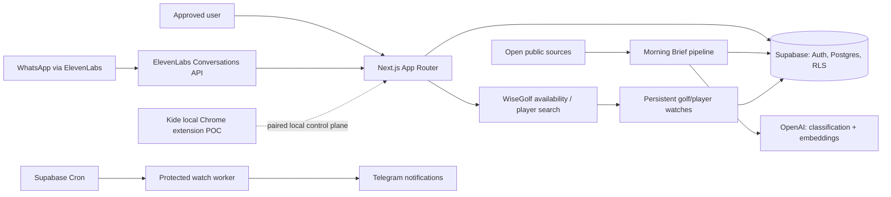

# Personal Assistant

Personal Assistant is a secure, full-stack personal operating system for turning scattered information and recurring tasks into useful, reviewable workflows. It combines personalized intelligence, ElevenLabs-powered conversational AI and WhatsApp visibility, monitoring and notification automation, and AI-assisted workflows in one authenticated application.

It is an active portfolio prototype built around a practical constraint: automation should be helpful, bounded, observable, and secure by default rather than an opaque chatbot with unrestricted access.

> **Status:** Active prototype / portfolio project. Some modules are mature and actively used by a single approved user; the local Kide Chrome reservation workflow remains an experimental, intentionally bounded proof of concept.

## Highlights

- **Morning Brief** — imports open public sources, normalizes and deduplicates stories, uses structured AI classification and embeddings, ranks content using portfolio relevance and learned feedback, then persists a daily brief and reading library.
- **ElevenLabs + WhatsApp conversation inbox** — a server-side ElevenLabs integration presents filtered conversation transcripts and WhatsApp context without exposing API credentials to the browser.
- **Protected AI tool endpoint** — an ElevenLabs golf-search tool uses independent bearer authentication, strict validation, per-user/global Supabase rate limits, and shared golf-search logic.
- **Golf monitoring and notifications** — WiseGolf availability and player searches can create persistent watches; a Supabase-triggered worker processes watches, isolates failures, and dispatches deduplicated Telegram notifications.
- **Security-first foundation** — Supabase Auth approval gates, row-level security, server-only service clients, narrowly scoped machine endpoints, and environment-based secrets separate user and service access.

## Architecture



### Morning Brief pipeline

```text
Public source adapters
  → normalize and validate
  → deduplicate and persist articles
  → structured classification (Luna by default; Terra only for exceptions)
  → embeddings when source text changes
  → clustering, ranking and personal relevance
  → persisted daily brief, library and feedback loop
```

Morning Brief does not use a scheduled ingestion job yet: an approved user initiates ingestion and regeneration. The model policy intentionally has no Sol fallback path.

### ElevenLabs and WhatsApp

The Conversations page uses server-side ElevenLabs API calls to list and enrich conversations for one configured agent. It safely renders text transcripts and detects WhatsApp context only when it is supported by returned data. The app also exposes a separate, machine-to-machine golf tool route for the agent; it is not a public proxy and does not rely on browser-session authentication.

Current scope is read-only conversation visibility plus golf tool calling. It does not send WhatsApp replies, use inbound webhooks, or persist conversation data locally.

### Automation with boundaries

Golf Watch and Player Watch records are stored in Supabase. An external Supabase Cron job invokes a protected route; the worker checks due watches, writes matches to a notification outbox, and sends retryable, deduplicated Telegram notifications. Individual watch/provider failures are isolated so one failure does not create a false positive or block unrelated work.

The Kide module includes a local Chrome extension proof of concept. It uses a paired local control plane, strict target validation, one-item/one-click limits, timeout limits, challenge detection, and stops before payment. It should not be treated as unattended purchasing automation.

## Product areas

| Area | What is implemented |
| --- | --- |
| Morning Brief | Public-source ingestion, classification/versioning, embeddings, ranking, feedback, library, and persisted daily briefs. |
| Conversations | Read-only ElevenLabs conversation list and transcript detail with WhatsApp-aware presentation when data supports it. |
| Golf | Multi-club tee-time availability, authenticated player search for configured clubs, watches, and Telegram dispatch. |
| Benefits | Aggregated Member+, CityShoppari, and Frank providers with isolated provider failures. |
| Calendar | Local calendar events plus private iCal import support. |
| Trips | Trip workspace with stored plans and AI-assisted structured plans, briefs, itineraries, budgets, and email drafts. |
| Kide | Paired local control plane and Chrome reservation POC; advanced always-on work is still in progress locally. |

## Tech stack

| Layer | Technology |
| --- | --- |
| Frontend | Next.js 15 App Router, React 19, TypeScript, Tailwind CSS, Lucide icons |
| Backend | Next.js route handlers and Server Actions with server-only integration modules |
| Data and auth | Supabase Auth, PostgreSQL, Row Level Security, Supabase SSR and service clients |
| AI | OpenAI structured classification and embeddings for Morning Brief; Anthropic SDK for trip assistance; ElevenLabs Conversational AI integration |
| Automation | Supabase Cron calling a protected Next.js worker; notification outbox and Telegram delivery |
| Browser automation research | Playwright and a local Chrome extension proof of concept for Kide |
| Deployment | Vercel for the Next.js application; Supabase for data and scheduled worker invocation |

## Security model

- Browser clients use Supabase's public client; privileged database work uses a separate `server-only` service client with session persistence disabled.
- Access to app data requires an authenticated, approved user. Database migrations establish user-scoped RLS policies.
- API keys, service credentials, bot tokens, private iCal URLs, WiseGolf credentials, and machine secrets are server-only environment variables.
- The only user-session bypasses are an explicit allowlist of machine endpoints, each validating its own bearer secret. The golf tool has validation and Supabase-backed rate limiting.
- Background notification delivery is outbox-based, retryable, and deduplicated.

## Local development

### Prerequisites

- Node.js 20+
- A Supabase project
- Provider credentials for only the modules you want to run

### Setup

```bash
npm install
cp .env.example .env.local
```

Populate `.env.local` with your own development values. The tracked [`.env.example`](.env.example) lists variable names and safe placeholders only. Apply the relevant tracked SQL migrations in [`db/migrations`](db/migrations) to a development Supabase project before using database-backed modules.

```bash
npm run dev
```

Open `http://localhost:3000` and use the signup/approval flow. Some integrations remain unavailable until their corresponding server-side variables are configured.

### Verification

```bash
npm run lint
npm run typecheck
npm run build
```

Focused tests use Node's test runner through `tsx`; there is intentionally no catch-all `npm test` script. Run the relevant `*.test.ts` files for the module being changed.

## Current status

✅ **Implemented**

- Secure approved-user application shell with Supabase-backed data access.
- Morning Brief ingestion, AI processing, personalization signals, daily brief persistence, and article library.
- ElevenLabs conversation/WhatsApp read-only inbox and protected golf tool integration.
- Golf availability, player watches, cron processing, notification outbox, and Telegram delivery.
- Benefits aggregation, calendar/iCal support, and AI-assisted trip workspace.

🚧 **In progress**

- Kide local Chrome extension and paired control-plane work, including further watch/event flow work that is not part of the committed public baseline.
- Expansion and operational validation of Morning Brief source adapters.

🗺 **Planned / intentionally not implemented**

- Scheduled Morning Brief ingestion.
- WhatsApp message sending, reply composition, and inbound webhook processing.
- Payment completion or unattended purchase flow for the Kide prototype.

## Repository guide

| Path | Purpose |
| --- | --- |
| [`app`](app) | App Router pages, layouts, and API route handlers. |
| [`components`](components) | Reusable UI and feature-specific client components. |
| [`lib`](lib) | Server-side domain modules: auth, Supabase, Morning Brief, golf, notifications, integrations, and actions. |
| [`db/migrations`](db/migrations) | PostgreSQL schema, RLS, and RPC migrations. |
| [`tools/kide-chrome-poc`](tools/kide-chrome-poc) | Local Chrome-extension proof of concept, not a cloud-side payment bot. |
| [`.env.example`](.env.example) | Safe environment-variable template; never commit real values. |

## Before publishing or deploying

1. Keep `.env*`, local browser profiles, logs, and local databases untracked.
2. Use a fresh Supabase project and new provider credentials.
3. Review migrations and RLS policies for your deployment model.
4. Configure the external Supabase Cron job only if golf watches are needed.
5. Treat the Kide proof of concept as local, supervised experimental software.

## Portfolio note

This project demonstrates an end-to-end personal AI system: full-stack application architecture with RLS-backed security boundaries, structured AI workflows, protected tool calling, persistent automation, and deliberately bounded browser-agent experimentation.
